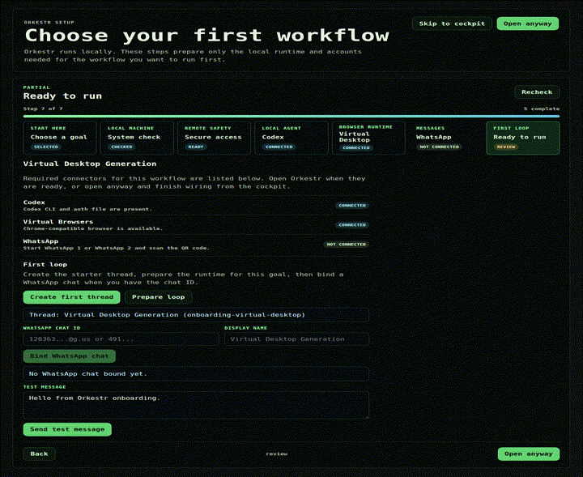
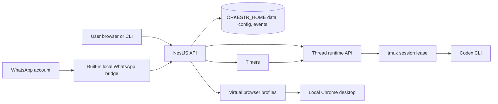

# Orkestr

Orkestr is a local-first workstation for running coding agents from your own machine.

It gives a local Codex session a control plane: setup, WhatsApp routing, virtual browser desktops, timers, logs, and a small web cockpit. It is designed for personal infrastructure first, not hosted multi-user SaaS.

> Public alpha. Do not expose Orkestr directly to the public internet. Keep it bound to `127.0.0.1` unless you have put it behind a trusted private network, TLS, and an auth boundary.



## Why This Exists

Coding agents are useful, but the useful work usually lives outside the chat window:

- a repository on disk
- a browser profile with user-owned login state
- a WhatsApp thread where the user actually gives instructions
- recurring tasks that should run without reopening an IDE
- logs that explain what happened after the agent wakes up

Orkestr makes those pieces explicit. The default target is a single developer running local agents on a laptop, workstation, or private VPS.

## Quickstart

Orkestr has two supported setup paths:

- **Local or beginner setup:** use Docker Compose. This is the fastest way to try Orkestr because the image includes Codex, tmux, git, ripgrep, Chromium, and the compiled web app.
- **VPS setup:** use the host-native systemd installer. This is the right shape for a real server because Caddy, Tailscale, browser desktops, service logs, and pairing approval are host-level operations.

### Local Docker

```bash
mkdir orkestr && cd orkestr
curl -fsSLO https://raw.githubusercontent.com/otcan/orkestr/main/docker-compose.yml
curl -fsSLo .env https://raw.githubusercontent.com/otcan/orkestr/main/.env.docker.example
docker compose up -d
```

Then open:

```text
http://127.0.0.1:19812/setup
```

In setup, choose the Codex workflow and either use **Open Codex sign-in** for
device authorization or **Connect Codex with API key**. Orkestr checks
`codex login status` before starting a coding thread, so a raw Codex login menu
is treated as setup work instead of being opened inside the agent runtime.
Runtime state, including Codex auth, is stored in the `orkestr-data` Docker
volume. Edit `.env` before starting the container to provide OpenAI,
Tailscale/Caddy, OAuth, workspace, or overlay settings.

### VPS Host-Native

```bash
curl -fsSL https://raw.githubusercontent.com/otcan/orkestr/main/scripts/install.sh | sudo bash -s -- --systemd
```

The host-native installer creates:

- `/opt/orkestr/app` for the cloned application
- `/opt/orkestr/data` for `ORKESTR_HOME`
- `/opt/orkestr/workspace` for agent workspaces
- `/etc/orkestr/orkestr.env` for server-local configuration
- `/usr/local/bin/orkestr` for the CLI
- `orkestr.service` for systemd

Then use normal server commands:

```bash
systemctl status orkestr
journalctl -u orkestr -f
orkestr security approve <challenge-id>
```

Edit `/etc/orkestr/orkestr.env` for OpenAI, OAuth, Caddy/Tailscale HTTPS, and private overlay settings. Keep the service bound to `127.0.0.1` and put Caddy/Tailscale in front before remote browser access.

Local clone flow:

```bash
git clone https://github.com/otcan/orkestr.git
cd orkestr
./scripts/install.sh --local --serve
```

Local Docker build flow:

```bash
cp .env.docker.example .env
docker compose -f docker-compose.yml -f docker-compose.build.yml up --build
```

Then open:

```text
http://127.0.0.1:19812/setup
```

Manual development flow:

```bash
npm ci
npm run build
npm start
```

Useful CLI commands:

```bash
npx orkestr-oss serve --open
npx orkestr-oss thread create "Repo launch reviewer" --cwd "$PWD" --executor codex
npx orkestr-oss send repo-launch-reviewer "Inspect this repo and list launch blockers."
npx orkestr-oss attach repo-launch-reviewer
```

## First Demo

Run the public dry-run coding-agent demo:

```bash
npm run demo:coding-agent
```

That demo starts Orkestr with a temporary local home, creates a coding-agent thread, prepares the virtual desktop profile, queues a repository-review task, and prints the public log. It does not require WhatsApp, Gmail, LinkedIn, or Codex credentials.

For a real Codex run, use the Docker local setup, the host-native VPS setup, or see [examples/coding-agent-demo/README.md](examples/coding-agent-demo/README.md).

Optional real Codex demo mode:

```bash
node scripts/coding-agent-demo.mjs --real-codex --repo "$PWD"
```

Regenerate the README demo asset:

```bash
npm run demo:record
```

Public demo logs live in [docs/demo-logs](docs/demo-logs).

## Architecture



More detail: [docs/architecture.md](docs/architecture.md).

## What Is Included

- First-run setup at `/setup`
- OpenAI and Codex connection checks
- Docker image with Codex, tmux, git, ripgrep, and Chromium installed
- Built-in local WhatsApp bridge with two QR-paired account slots
- Thread-first runtime API for local Codex sessions
- Virtual browser registry, including a general-purpose virtual desktop
- Gmail OAuth surface
- LinkedIn and Gmail browser profiles
- Timers and manual timer runs
- CLI for listing, creating, waking, sending to, and attaching threads
- Local activity logs and deterministic public demos

## Security Warning

Orkestr can wake local agents, pass text into terminal sessions, open browser profiles, and store connector credentials under `ORKESTR_HOME`.

Minimum safe defaults:

- Keep `ORKESTR_HOST=127.0.0.1`.
- Do not expose raw `/api/*`, thread streams, or terminal routes to the public internet.
- Use Tailscale plus Caddy/TLS before remote access.
- Keep real overlays, browser profiles, WhatsApp session state, Gmail tokens, and hostnames out of this public repo.
- Treat this alpha as single-user software.

See [SECURITY.md](SECURITY.md).

## Roadmap

Near-term launch work:

- Secure access onboarding: Caddy/Tailscale HTTPS checks and first-browser pairing.
- Better setup path naming and legacy `/ng/*` compatibility cleanup.
- A recorded end-to-end demo video using a real local Codex session.
- More complete browser desktop controls and status.
- Public examples for WhatsApp-to-thread routing and timers.

Full roadmap: [ROADMAP.md](ROADMAP.md).

## Contributing

Contributions are welcome while the project is still small. Start with:

```bash
npm run check
npm run demo:coding-agent
npm run launch:check
```

Public code must not include credentials, private hostnames, personal browser profiles, WhatsApp IDs, private prompts, or deployment-only paths. See [CONTRIBUTING.md](CONTRIBUTING.md) for the working rules.

## Public/Private Boundary

Generic product code belongs here. Personal deployment code belongs outside this repo and is loaded through `ORKESTR_OVERLAY_DIR`.

Examples of private-only material:

- real connector credentials
- real WhatsApp chat IDs
- browser profile state
- personal prompts and timers
- VPS hostnames
- host-specific Codex launch behavior

See [docs/private-overlay.md](docs/private-overlay.md).
