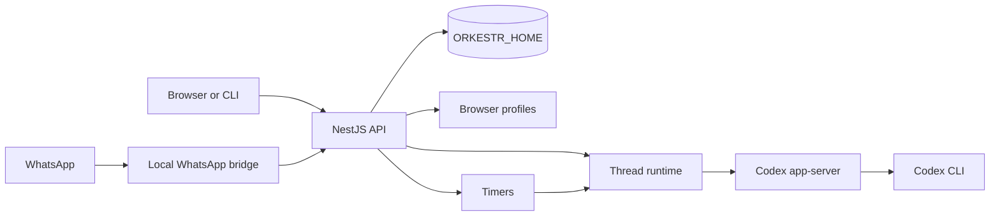

# Orkestr

Orkestr is a small self-hosted app around Codex.

It gives Codex a durable home: persistent threads, browser control, status,
interruptions, WhatsApp routing, timers, and local ops from a web UI or CLI.
Codex remains the agent. Orkestr is the control surface around it.

> Public alpha. The supported remote shape works out of the box through the
> host-native installer: Orkestr binds to `127.0.0.1`, remote access goes
> through Tailscale or Caddy/TLS, and browser pairing gates access. Do not expose
> raw Orkestr API, thread, or terminal routes directly to the public internet.


The generated README asset combines a generated WhatsApp source panel, a fresh
TMUX capture, and an Orkestr Web UI rendering. It must not contain real tokens,
phone numbers, chat IDs, local paths, or private hosts.

## Why This Exists

Use Orkestr when one terminal Codex session stops being enough:

- you want named Codex threads that survive disconnects
- you want to control Codex from a browser or phone
- you want queue, status, approvals, interruptions, and history
- you want optional WhatsApp routing into a thread
- you want a private workstation or VPS instead of a hosted control plane

If you only need one interactive Codex terminal, use Codex directly.

## Quickstart

### Local Host-Native

```bash
curl -fsSL https://raw.githubusercontent.com/otcan/orkestr/main/scripts/install.sh | bash
```

Then open:

```text
http://127.0.0.1:19812/setup
```

The installer creates a local service, prepares `ORKESTR_HOME`, installs the CLI,
and starts Orkestr. It asks only whether to enable YOLO mode for Codex; press
Enter to keep the safer default.

Useful local commands:

```bash
orkestr service status
orkestr service logs
orkestr service stop
orkestr service start
```

For source work:

```bash
git clone https://github.com/otcan/orkestr.git
cd orkestr
./scripts/install.sh --local
```

### VPS Host-Native

For a fresh Ubuntu 24.04 VPS:

```bash
curl -fsSL https://raw.githubusercontent.com/otcan/orkestr/main/scripts/bootstrap-vps.sh | sudo bash
```

For lower-level systemd installation on a prepared host:

```bash
curl -fsSL https://raw.githubusercontent.com/otcan/orkestr/main/scripts/install.sh | sudo bash -s -- --systemd
```

Useful server commands:

```bash
orkestr status
orkestr logs
orkestr doctor
orkestr security approve <challenge-id>
orkestr security sessions
```

## First Run

1. Open `/setup`.
2. Connect Codex.
3. Create or import a thread.
4. Send work from the web UI or CLI.
5. Optionally connect WhatsApp, timers, Gmail, or browser desktops.

CLI example:

```bash
orkestr thread create "Repo launch reviewer" --cwd "$PWD" --executor codex
orkestr send repo-launch-reviewer "Inspect this repo and list launch blockers. Do not edit files."
orkestr attach repo-launch-reviewer
```

## Demo

Run the deterministic public demo:

```bash
npm run demo:coding-agent
```

It starts Orkestr with a temporary home, creates a coding-agent thread, prepares
a virtual desktop profile, queues a repository-review task, and exits without
requiring Codex, WhatsApp, Gmail, or LinkedIn credentials.

For the full walkthrough, see
[examples/coding-agent-demo/README.md](examples/coding-agent-demo/README.md).

## What Is Included

- setup UI at `/setup`
- named Codex threads with status, queue, stop, attach, and history
- Codex app-server based thread runtime for new coding threads
- web UI and CLI control
- optional built-in local WhatsApp bridge
- optional timers
- optional browser desktop profiles
- secure-input secret manager
- local health checks, logs, smoke tests, and release checks

## Architecture



More detail: [docs/architecture.md](docs/architecture.md).

## Security Model

Orkestr can wake agents, pass text into runtimes, open browser profiles, and
store connector state under `ORKESTR_HOME`.

Default remote rules:

- keep Orkestr bound to `127.0.0.1`
- use Tailscale or Caddy/TLS for remote access
- keep browser pairing enabled
- keep real credentials, browser profiles, WhatsApp sessions, private prompts,
  and hostnames out of this repo
- use secure-input or host secret storage for secret values

See [SECURITY.md](SECURITY.md).

## Updates And Releases

### On-Box Update Watcher

For a personal VPS that tracks `main`:

```bash
curl -fsSL https://raw.githubusercontent.com/otcan/orkestr/main/scripts/install.sh | sudo bash -s -- --systemd --track-main
```

This installs `orkestr-update.timer`. New commits become versioned releases such
as `main-<short-commit>`.

Useful commands:

```bash
orkestr update status
sudo orkestr update
sudo orkestr rollback
```

### Versioned Git Releases

For stricter installs, deploy an exact tag:

```bash
sudo orkestr update --release --ref v0.1.0-alpha.26 --channel production
orkestr-deploy status
orkestr-deploy rollback
```

The running app reports release metadata at `/api/version`.

More detail: [docs/framework-deployment.md](docs/framework-deployment.md).

## OSS vs Managed

This public repo is the OSS distribution: the self-hosted Codex control center.
It should install and run without private operator state.

Managed/private deployment code belongs outside this repo and may add private
overlays, production routing, managed broker inventory, and real account
bindings.

See [docs/oss-managed-boundary.md](docs/oss-managed-boundary.md).

## Documentation Map

- [User guide](docs/user-guide.md)
- [Framework and deployment](docs/framework-deployment.md)
- [OSS vs managed boundary](docs/oss-managed-boundary.md)
- [Secret manager](docs/secret-manager.md)
- [Security](SECURITY.md)
- [Contributing](CONTRIBUTING.md)
- [Roadmap](ROADMAP.md)

## Development

```bash
npm ci
npm run build
npm run smoke
npm run demo:coding-agent
npm run launch:check
```

When changing the UI, run `npm run web:build` and commit the updated `dist/web`
bundle.

## License

MIT. See [LICENSE](LICENSE).
