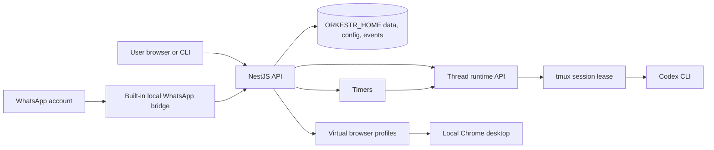

# Orkestr

Orkestr is a self-hosted agent workstation for running Codex from a browser, CLI, or WhatsApp.

It gives you a public-facing web layer for setup, chat, status, pairing, and operations while keeping the actual agent runtime on infrastructure you control. Create named Codex threads, give them workspaces, start or sleep them, inspect status, connect WhatsApp or Gmail, attach virtual desktops, and review logs from one cockpit.

> Public alpha. The host-native VPS path supports protected remote access out of the box: Orkestr stays bound to `127.0.0.1`, the bootstrap can expose it through Tailscale or Caddy/TLS, and browser pairing/auth gates access. Do not bind the raw Orkestr service or terminal/API routes directly to the public internet.


Start with the [user guide](docs/user-guide.md), then use the quickstart below when you are ready to install.

## Documentation Map

- [User guide](docs/user-guide.md): product concepts, first-time setup, and common workflows.
- [Framework and deployment](docs/framework-deployment.md): local install, VPS bootstrap, updater, versioned releases, and smoke tests.
- [Security](SECURITY.md): remote-access shape, browser pairing, and secret-handling rules.
- [Contributing](CONTRIBUTING.md): contributor workflow, automation map, and pull request expectations.
- [Architecture](docs/architecture.md): package boundaries, runtime boundary, and connector boundary.

## Why Use Orkestr

- **No OpenAI API credit meter for the default Codex path.** Use your existing Codex login instead of wiring every agent task through paid API calls.
- **Persistent agents, not simple chat automation.** Orkestr manages real Codex sessions with workspaces, queues, status, recovery, logs, and browser access.
- **Timers for recurring work.** Agents can wake later, continue a task, check a repository, or run scheduled prompts without reopening an IDE.
- **Real work surfaces.** Connect WhatsApp, Gmail, LinkedIn browser profiles, virtual desktops, and future local connectors into the same agent control plane.
- **User-controlled infrastructure.** Keep workspaces, runtime state, connector sessions, and private overlays on a laptop, workstation, private VPS, or k3s host you control.

## Why This Exists

Coding agents are useful, but the useful work usually lives outside the chat window:

- a repository on disk
- a browser profile with user-owned login state
- a WhatsApp thread where the user actually gives instructions
- recurring tasks that should run without reopening an IDE
- logs that explain what happened after the agent wakes up

Orkestr makes those pieces explicit. The default target is a single developer running agents on a laptop, workstation, private VPS, or k3s-backed demo host.

## What Orkestr Lets You Do

- **Run multiple Codex instances:** create named coding agents and worker threads instead of juggling anonymous terminal panes.
- **Control agent lifecycle:** start, wake, sleep, attach, and inspect ready/working/error status from the web UI or CLI.
- **Give every agent a real workspace:** clone a repo when you have one, or let Orkestr generate a local git workspace when you do not.
- **Route WhatsApp into agents:** connect one or two local WhatsApp Web accounts, create or bind a chat, and mirror agent replies back to the conversation.
- **Connect mail and browser accounts:** configure Gmail OAuth, keep browser-backed Gmail/LinkedIn profiles local, and add private connector overlays without putting credentials in the public repo.
- **Use virtual desktops:** launch managed Chrome desktop profiles for browser work, login state, and future CDP-backed tasks.
- **Schedule recurring work:** create timers that wake a thread and send a prompt on a cadence.
- **Operate the box:** run `orkestr doctor`, watch logs, reset disposable VPS state, and keep a host-native install updated from the server itself.

Dropbox and other file-source bindings are not shipped as public OSS V1 connectors yet. The intended path is the same connector/binding model: keep private credentials in overlays, then bind those sources to an agent without copy-pasting context into chat.

## Quickstart

Orkestr has two supported setup paths:

- **Local or beginner setup:** use the local installer from a checkout. A meaningful local setup includes Codex and WhatsApp; `local-safe` keeps Codex approvals on and mirrors permission prompts through Orkestr/WhatsApp.
- **VPS setup:** use the host-native systemd installer. This is the right shape for a real server because Caddy, Tailscale, browser desktops, service logs, and pairing approval are host-level operations.

### Local Host-Native

```bash
git clone https://github.com/otcan/orkestr.git
cd orkestr
./scripts/install.sh --local --serve
```

Then open:

```text
http://127.0.0.1:19812/setup
```

In setup, choose what to add first, then connect the required accounts. For
Codex, use **Open Codex sign-in** for device authorization or **Connect Codex
with API key** when this runtime should authenticate Codex that way. Orkestr
checks `codex login status` before starting a coding thread, so a raw Codex
login menu is treated as setup work instead of being opened inside the agent
runtime. Runtime state, including Codex auth, is stored under `ORKESTR_HOME`.
Use `.env` or the setup UI for optional OpenAI direct API access,
Tailscale/Caddy settings, OAuth credentials, workspace roots, or overlay
settings. If you upload or paste an `.env` during setup, Orkestr reads that
file as runtime configuration and stores it with the same local runtime state.

### VPS Host-Native

For a fresh VPS, choose **Ubuntu 24.04 LTS Server x64**. Use at least 2 vCPU,
4 GB RAM, and 60 GB disk; 4 vCPU and 8 GB RAM is more comfortable when browser
profiles, WhatsApp, and multiple Codex sessions are active.

The easiest fresh-server path is the opinionated bootstrap script:

```bash
curl -fsSL https://raw.githubusercontent.com/otcan/orkestr/main/scripts/bootstrap-vps.sh | sudo bash
```

It checks the OS and basic resources, installs Tailscale by default, runs the
host-native systemd installer with main-tracking versioned updates enabled,
configures optional demo/WhatsApp/domain settings, keeps Orkestr on localhost
with browser pairing enabled, and prints the setup URL and next commands.

Useful variants:

```bash
# Disposable demo server with Tailscale installed.
curl -fsSL https://raw.githubusercontent.com/otcan/orkestr/main/scripts/bootstrap-vps.sh | sudo bash -s -- --demo

# Public HTTPS domain through Caddy.
curl -fsSL https://raw.githubusercontent.com/otcan/orkestr/main/scripts/bootstrap-vps.sh | sudo bash -s -- --domain orkestr.example.com

# Custom branch or fork.
curl -fsSL https://raw.githubusercontent.com/otcan/orkestr/main/scripts/bootstrap-vps.sh | sudo bash -s -- --repo https://github.com/you/orkestr.git --ref main
```

Installer changes can be tested against a brand-new disposable AWS VPS:

```bash
npm run smoke:vps:aws
```

That runner creates a fresh Ubuntu 24.04 EC2 host, runs the bootstrap installer,
runs the Orkestr smoke test on the VPS, verifies the protected host-native
shape, and deletes the temporary AWS resources.
Add `-- --with-whatsapp` to also start the built-in WhatsApp bridge and wait for
QR readiness on the fresh VPS. For an interactive phone-code link test, pass
`-- --with-whatsapp --whatsapp-phone <number> --create-whatsapp-thread "WhatsApp VPS Smoke" --keep`.

The lower-level installer remains available when you already know the host is
prepared:

```bash
curl -fsSL https://raw.githubusercontent.com/otcan/orkestr/main/scripts/install.sh | sudo bash -s -- --systemd
```

By default the installer writes a safe profile: `local-safe` for local installs
and `vps-safe` for systemd installs. Safe profiles start Codex with
`--sandbox workspace-write --ask-for-approval on-request --no-alt-screen` so
permission requests can be surfaced in the UI and WhatsApp. Trusted profiles are
explicit:

```bash
scripts/install.sh --local --profile local-trusted
sudo scripts/install.sh --systemd --profile vps-trusted
```

The installer also writes a non-secret runtime settings contract at
`$ORKESTR_HOME/runtime-settings.json`. It records the selected Codex sandbox and
approval policy, managed desktop slugs, Gmail auth desktop, Outlook device-auth
route, and WhatsApp sender/responder role names. Tokens, OAuth refresh tokens,
browser profiles, and private keys are not stored there.

The host-native installer creates:

- `/opt/orkestr/app` for the cloned application
- `/opt/orkestr/data` for `ORKESTR_HOME`
- `/opt/orkestr/workspace` for agent workspaces
- `/etc/orkestr/orkestr.env` for server-local configuration
- `/opt/orkestr/data/runtime-settings.json` for non-secret Codex/desktop/connector routing settings
- `/usr/local/bin/orkestr` for the CLI
- `orkestr.service` for systemd

Then use normal server commands:

```bash
systemctl status orkestr
journalctl -u orkestr -f
orkestr doctor
orkestr security approve <challenge-id>
```

The host CLI is safe to run from a root SSH session. It drops to the
configured `ORKESTR_RUN_USER` before touching Orkestr state, so files under
`ORKESTR_HOME` remain writable by `orkestr.service`.

Edit `/etc/orkestr/orkestr.env` for optional OpenAI direct API access, OAuth, Caddy/Tailscale HTTPS, and private overlay settings. The host-native installer keeps the service bound to `127.0.0.1`, enables browser pairing by default, and can put Caddy/Tailscale in front for remote browser access.

### On-Box Update Watcher

For a personal VPS, keep deployment on the box:

```bash
curl -fsSL https://raw.githubusercontent.com/otcan/orkestr/main/scripts/install.sh | sudo bash -s -- --systemd --track-main
```

That installs `orkestr-update.timer`. The timer runs `orkestr-update` every two
minutes, fetches `origin/main`, builds a versioned release when the commit
changes, flips `/opt/orkestr/current`, and restarts `orkestr.service` after a
successful health check. Main-tracking releases are named
`main-<short-commit>`. The updater keeps `/etc/orkestr/orkestr.env` local to
the server.

For disposable test VPS deployments, set `ORKESTR_RESET_ON_UPDATE=1` in
`/etc/orkestr/orkestr.env`. Successful updates will wipe `ORKESTR_HOME` and
the workspace root before restarting the service, while preserving the env
file and host proxy setup. Use `ORKESTR_RESET_OVERLAY=1` only when the overlay
is also disposable. Run `orkestr-reset-state` for a one-time manual reset.

Useful updater commands:

```bash
systemctl list-timers orkestr-update.timer
journalctl -u orkestr-update -f
orkestr-deploy status
orkestr update status
sudo orkestr update --track-main --no-smoke
sudo orkestr update --release --ref v0.1.7 --channel production
orkestr doctor
orkestr-update
orkestr-reset-state
```

### Versioned Git Releases

For personal or demo VPS installs, `--track-main` gives fast versioning without
manual tags: every new `main` commit becomes a release under
`/opt/orkestr/releases/main-<short-commit>`, with rollback available through the
CLI. For stricter production installs, prefer immutable git tags. The release
deployer builds each selected ref in a fresh directory, writes a
`release-manifest.json`, backs up `ORKESTR_HOME`, flips the active symlink,
restarts the service, and records the result in `deployments.json`:

```bash
ORKESTR_RELEASE_DEPLOY=1 ORKESTR_UPDATE_REF=main ORKESTR_DEPLOY_CHANNEL=main ORKESTR_DEPLOY_TAGS_ONLY=0 orkestr-update
sudo orkestr update --track-main --no-smoke
sudo orkestr update --release --ref v0.1.7 --channel production
orkestr update status
orkestr update rollback
orkestr-deploy install --ref v0.1.7 --channel production
orkestr-deploy status
orkestr-deploy rollback
```

Default release layout:

```text
/opt/orkestr/releases/<release-id>/
/opt/orkestr/current -> /opt/orkestr/releases/<release-id>
/opt/orkestr/backups/
/opt/orkestr/deployments.json
```

Production release deploys require an exact git tag by default. Staging/demo
can set `ORKESTR_DEPLOY_TAGS_ONLY=0` to deploy `main` or a specific SHA. The
running app exposes the active commit, tag/describe string, channel, release
id, dirty flag, and deployment time from `/api/version`.

Local clone flow:

```bash
git clone https://github.com/otcan/orkestr.git
cd orkestr
./scripts/install.sh --local --serve
```

Then open:

```text
http://127.0.0.1:19812/setup
```

Manual development flow:

```bash
npm ci
npm run build
npm start
```

Useful CLI commands:

```bash
npx orkestr-oss serve --open
npx orkestr-oss thread create "Repo launch reviewer" --cwd "$PWD" --executor codex
npx orkestr-oss send repo-launch-reviewer "Inspect this repo and list launch blockers."
npx orkestr-oss attach repo-launch-reviewer
```

## First Demo

Run the public dry-run coding-agent demo:

```bash
npm run demo:coding-agent
```

That demo starts Orkestr with a temporary local home, creates a coding-agent thread, prepares the virtual desktop profile, queues a repository-review task, and prints the public log. It does not require WhatsApp, Gmail, LinkedIn, or Codex credentials.

For a real Codex run, use the local host-native setup, the host-native VPS setup, or see [examples/coding-agent-demo/README.md](examples/coding-agent-demo/README.md).

Optional real Codex demo mode:

```bash
node scripts/coding-agent-demo.mjs --real-codex --repo "$PWD"
```

Regenerate the public three-screen proof asset:

```bash
npm run demo:record
```

The generated README asset combines the saved WhatsApp source screenshot with
a fresh TMUX capture and an Orkestr Web UI rendering that show the same public
GitHub verification lines. It must not include tokens, private chat IDs, phone
numbers, local paths, or private ops hosts.

Public demo logs live in [docs/demo-logs](docs/demo-logs).

## Architecture



More detail: [docs/architecture.md](docs/architecture.md).

## What Is Included

- First-run setup at `/setup`
- OpenAI and Codex connection checks
- Multiple named Codex threads with start, sleep, wake, attach, and status controls
- Built-in local WhatsApp bridge with two QR-paired account slots
- WhatsApp chat creation and thread binding
- Thread-first runtime API for local Codex sessions
- Virtual browser registry, including a general-purpose virtual desktop
- Gmail OAuth surface
- LinkedIn and Gmail browser profiles
- Timers and manual timer runs
- Host/system doctor for runtime, browser, Codex, Caddy/Tailscale, and writable data paths
- CLI for listing, creating, waking, sleeping, sending to, and attaching threads
- Local activity logs and deterministic public demos

## Security Model

Orkestr can wake local agents, pass text into terminal sessions, open browser profiles, and store connector credentials under `ORKESTR_HOME`.

The supported remote shape is provided by the host-native installer and covered by the VPS smoke path:

- Keep `ORKESTR_HOST=127.0.0.1`.
- Use Tailscale or Caddy/TLS before remote access.
- Keep `ORKESTR_AUTH_REQUIRED=1` and approve browsers through the setup pairing flow.
- Do not expose raw `/api/*`, thread streams, or terminal routes directly to the public internet.
- Keep real overlays, browser profiles, WhatsApp session state, Gmail tokens, and hostnames out of this public repo.
- Treat this alpha as single-user software.

See [SECURITY.md](SECURITY.md).

## Roadmap

Near-term launch work:

- Out-of-box secure access hardening: smoother Caddy/Tailscale validation, clearer pairing diagnostics, and safer remote-access defaults.
- Better setup path naming and legacy `/ng/*` compatibility cleanup.
- A recorded end-to-end demo video using a disposable local Codex session.
- More complete browser desktop controls and status.
- Public examples for WhatsApp-to-thread routing and timers.

Full roadmap: [ROADMAP.md](ROADMAP.md).

## Contributing

Contributions are welcome while the project is still small. Start with:

```bash
npm run check
npm run demo:coding-agent
npm run launch:check
```

Public code must not include credentials, private hostnames, personal browser profiles, WhatsApp IDs, private prompts, or deployment-only paths. See [CONTRIBUTING.md](CONTRIBUTING.md) for the working rules.

## License

Orkestr is released under the MIT License. See [LICENSE](LICENSE).

## Public/Private Boundary

Generic product code belongs here. Personal deployment code belongs outside this repo and is loaded through `ORKESTR_OVERLAY_DIR`.

Examples of private-only material:

- real connector credentials
- real WhatsApp chat IDs
- browser profile state
- personal prompts and timers
- VPS hostnames
- host-specific Codex launch behavior

See [docs/private-overlay.md](docs/private-overlay.md).
