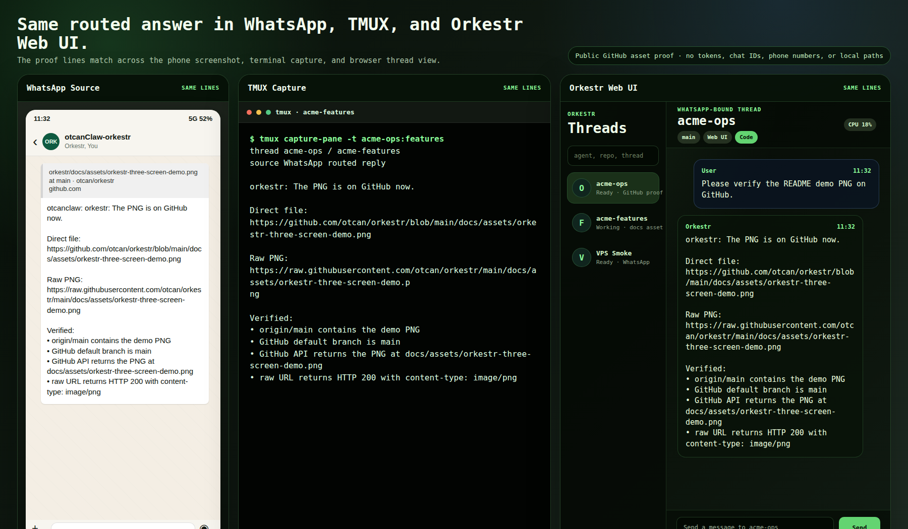
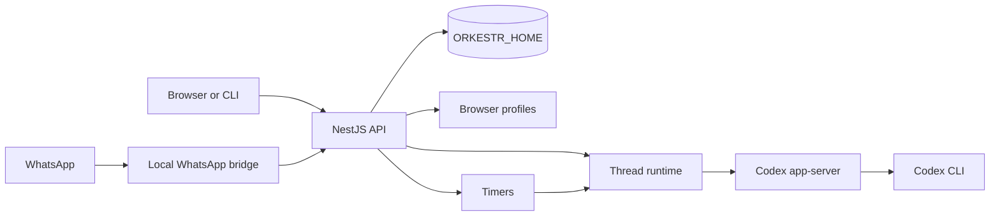

# Orkestr

Orkestr is a small self-hosted app around Codex.

It gives Codex a durable home: persistent threads, browser control, status,
interruptions, WhatsApp routing, timers, and local ops from a web UI or CLI.
Codex remains the agent. Orkestr is the control surface around it.

> Public alpha. The Docker/Helm path is the primary OSS demo path. Browser
> pairing gates remote access; do not expose raw Orkestr API, thread, desktop,
> or terminal routes directly to the public internet.



The generated README asset combines a generated WhatsApp source panel, a fresh
TMUX capture, and an Orkestr Web UI rendering. It must not contain real tokens,
phone numbers, chat IDs, local paths, or private hosts.

## Why This Exists

Use Orkestr when one terminal Codex session stops being enough:

- you want named Codex threads that survive disconnects
- you want to control Codex from a browser or phone
- you want queue, status, approvals, interruptions, and history
- you want optional WhatsApp routing into a thread
- you want a private workstation or VPS instead of a hosted control plane

If you only need one interactive Codex terminal, use Codex directly.

## Quickstart

### Docker

```bash
docker run -p 3000:3000 -v orkestr-data:/data orkestr/orkestr:latest
```

Then open:

```text
http://127.0.0.1:3000/setup
```

The container stores Orkestr state in `/data`, including workspaces, browser
profiles, secrets, and `CODEX_HOME=/data/codex`.

First run:

1. Connect Codex.
2. Choose WhatsApp access: Orkestr relay or your own WhatsApp bridge.
3. Start the default `orkest` thread.
4. Orkestr starts Virtual Desk for that thread.

### Private VM Demo

The demo does not need a permanent public app URL. Run Orkestr on a VM and
provide the target WhatsApp number:

```bash
ORKESTR_DEMO_WHATSAPP_NUMBER="+4917600000000"
```

When the VM is up, Orkestr sends that number one WhatsApp readiness message
through the pre-provisioned relay bridge. Before creating the setup link, the VM
registers with the Orkestr broker through `POST /api/broker/instances/register`
and receives a broker-generated UUID plus encrypted channel bootstrap material.
Configure a stable public base URL such as `https://connect.orkestr.de`; Orkestr
sends a challenge-gated `/setup/pairing?instanceId=<broker-uuid>&return=/setup`
link on that host. That page creates a browser-pairing challenge before setup
opens. The broker UUID is also stored on the challenge so operators and brokers
can distinguish many VMs using one public domain. The setup flow then lets you
connect Codex, keep the Orkestr relay or switch to your own WhatsApp relay, and
start the default `orkest` thread.

Relay operators can pre-provision these values in the VM image, Helm release, or
secret manager so evaluators only edit the WhatsApp number:

```bash
ORKESTR_BROKER_REGISTRATION_TOKEN="..."
ORKESTR_DEMO_WHATSAPP_RELAY_URL="http://relay.internal/api/connectors/whatsapp/bridge"
ORKESTR_DEMO_WHATSAPP_RELAY_TOKEN="..."
ORKESTR_DEMO_WHATSAPP_RELAY_ACCOUNT_ID="responder"
```

Optional URL overrides:

```bash
# Use a known public base URL and still route through browser pairing.
ORKESTR_CONNECT_PUBLIC_BASE_URL="https://connect.orkestr.de"

# Or provide an exact public setup/pairing URL without an instanceId.
# The notifier adds instanceId=<broker-uuid> after registration.
ORKESTR_CONNECT_PUBLIC_SETUP_URL="https://connect.orkestr.de/setup/pairing?return=%2Fsetup"
```

Cloudflare quick tunnel fallback is for local ad hoc testing only. It is off by
default; enable it explicitly with `ORKESTR_DEMO_CLOUDFLARE_FALLBACK=1` or Helm
`demo.cloudflareFallback: true`. For demo-review runs, set
`demo.publicBaseUrl` or `demo.setupUrl` instead.

Localhost setup links are blocked by default for WhatsApp onboarding. Use
`ORKESTR_DEMO_ALLOW_LOCAL_SETUP_URL=1` only for local tests.

On the relay/router, prefer a scoped bridge token for each demo VM or demo
recipient set:

```bash
ORKESTR_WHATSAPP_BRIDGE_SCOPED_TOKENS_JSON='[
  {
    "id": "demo-vm-1",
    "token": "...",
    "scopes": ["whatsapp:bridge:send"],
    "accountId": "responder",
    "allowedPhoneNumbers": ["+4917600000000"]
  }
]'
```

That token can send only through the declared responder account and only to the
listed WhatsApp recipient numbers. It is enough for the VM readiness message and
does not grant bridge read, manage, inbound injection, or arbitrary send access.

If you intentionally keep a single configured bridge token on the router, add a
recipient allowlist next to it:

```bash
ORKESTR_WHATSAPP_BRIDGE_TOKEN="..."
ORKESTR_WHATSAPP_BRIDGE_ACCOUNT_ID="responder"
ORKESTR_WHATSAPP_BRIDGE_ALLOWED_PHONE_NUMBERS="+4917600000000,+4917600000001"
```

For a parent relay proxy in front of an already-paired Orkestr router, run the
versioned proxy with the same narrow boundary:

```bash
ORKESTR_PARENT_WA_BRIDGE_TOKEN="..."
ORKESTR_PARENT_WA_BRIDGE_UPSTREAM="http://127.0.0.1:18912/api/connectors/whatsapp/bridge"
ORKESTR_PARENT_WA_BRIDGE_ALLOWED_ACCOUNTS="responder"
ORKESTR_PARENT_WA_BRIDGE_ALLOWED_PHONE_NUMBERS="+4917600000000"
node scripts/parent-whatsapp-bridge-proxy.mjs
```

The proxy rejects unauthenticated requests, wrong accounts, and non-allowlisted
recipients before forwarding a send request upstream.

With those allowlist variables present, bridge sends using that token are
checked against the declared account and recipient numbers.

### Helm

```bash
helm install orkestr ./charts/orkestr
```

### Source/Host-Native

```bash
git clone https://github.com/otcan/orkestr.git
cd orkestr
npm ci
npm run build
ORKESTR_HOME="$PWD/.orkestr-data" CODEX_HOME="$PWD/.orkestr-data/codex" ORKESTR_PORT=3000 ORKESTR_HOST=127.0.0.1 npm start
```

The host-native installer still exists for private workstations and VPS installs:

```bash
curl -fsSL https://raw.githubusercontent.com/otcan/orkestr/main/scripts/install.sh | bash
```

Useful server commands:

```bash
orkestr status
orkestr logs
orkestr doctor
orkestr security approve <challenge-id>
orkestr security sessions
```

## Demo

Run the OSS demo contract smoke:

```bash
npm run smoke:k3s:oss-demo
```

It checks the Docker contract, Helm chart, first-run `orkest` path, WhatsApp
trust choice, Virtual Desk startup wiring, and verifies the demo path is not
using the noop executor.

For a live k3s smoke on a host with Docker, Helm, and kubectl:

```bash
ORKESTR_K3S_OSS_DEMO_EXECUTE=1 npm run smoke:k3s:oss-demo
```

The older deterministic coding-agent demo is still available for local
development:

```bash
npm run demo:coding-agent
```

## What Is Included

- setup UI at `/setup`
- named Codex threads with status, queue, stop, attach, and history
- Codex app-server based thread runtime for new coding threads
- web UI and CLI control
- optional built-in local WhatsApp bridge
- optional timers
- Virtual Desk browser profiles
- secure-input secret manager
- local health checks, logs, smoke tests, and release checks

## Architecture



More detail: [docs/architecture.md](docs/architecture.md).

## Security Model

Orkestr can wake agents, pass text into runtimes, open browser profiles, and
store connector state under `ORKESTR_HOME`.

Default remote rules:

- keep Orkestr bound to `127.0.0.1`
- use Tailscale or Caddy/TLS for remote access
- keep browser pairing enabled
- keep real credentials, browser profiles, WhatsApp sessions, private prompts,
  and hostnames out of this repo
- use secure-input or host secret storage for secret values

See [SECURITY.md](SECURITY.md).

## Updates And Releases

### On-Box Update Watcher

For a personal VPS that tracks `main`:

```bash
curl -fsSL https://raw.githubusercontent.com/otcan/orkestr/main/scripts/install.sh | sudo bash -s -- --systemd --track-main
```

This installs `orkestr-update.timer`. New commits become versioned releases such
as `main-<short-commit>`.

Useful commands:

```bash
orkestr update status
sudo orkestr update
sudo orkestr rollback
```

### Versioned Git Releases

For stricter installs, deploy an exact tag:

```bash
sudo orkestr update --release --ref v0.1.0-alpha.26 --channel production
orkestr-deploy status
orkestr-deploy rollback
```

The running app reports release metadata at `/api/version`.

More detail: [docs/framework-deployment.md](docs/framework-deployment.md).

## OSS vs Managed

This public repo is the OSS distribution: the self-hosted Codex control center.
It should install and run without private operator state.

Managed/private deployment code belongs outside this repo and may add private
overlays, production routing, managed broker inventory, and real account
bindings.

See [docs/oss-managed-boundary.md](docs/oss-managed-boundary.md).

## Documentation Map

- [User guide](docs/user-guide.md)
- [Framework and deployment](docs/framework-deployment.md)
- [OSS vs managed boundary](docs/oss-managed-boundary.md)
- [Secret manager](docs/secret-manager.md)
- [Security](SECURITY.md)
- [Contributing](CONTRIBUTING.md)
- [Roadmap](ROADMAP.md)

## Development

```bash
npm ci
npm run pipeline:full
```

`pipeline:full` runs the local release gate: build, full CI tests, OSS boundary
check, demo/k3s contracts, VM demo smoke, app smoke, and the coding-agent demo.
Use `npm run pipeline:full -- --plan` to inspect the exact stages. Live k3s,
AWS VPS, release regression, and deploy steps are opt-in flags. Real WhatsApp
E2E is opt-in for local-only runs, but it is required automatically when
`pipeline:full` is asked to deploy with `--deploy-ref`; use
`--allow-release-without-e2e` only as an explicit emergency bypass.

When changing the UI, run `npm run web:build` and commit the updated `dist/web`
bundle.

### Connector Outbox Storage

The connector outbox uses SQLite by default when `node:sqlite` is available.
Existing `connector-outbox.json` state is migrated into
`connector-outbox.sqlite` on first use, then hot outbox actions use indexed
SQLite updates instead of rewriting the JSON file. Set
`ORKESTR_CONNECTOR_OUTBOX_STORE=json` only as an emergency legacy fallback.

`ORKESTR_CONNECTOR_OUTBOX_STORE=postgres` is reserved for a future managed-scale
backend and currently fails closed instead of silently falling back.

## License

MIT. See [LICENSE](LICENSE).
