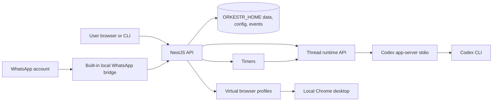

# Orkestr

Orkestr is a small self-hosted app around Codex.

Codex remains the agent. Orkestr gives it a durable home: setup, named threads,
workspaces, status, interruptions, WhatsApp routing, timers, and basic ops from
a browser or CLI. The runtime stays on infrastructure you control.

> Public alpha. The host-native VPS path supports protected remote access out of the box: Orkestr stays bound to `127.0.0.1`, the bootstrap can expose it through Tailscale or Caddy/TLS, and browser pairing/auth gates access. Do not bind the raw Orkestr service or terminal/API routes directly to the public internet.


Start with the [user guide](docs/user-guide.md), then use the quickstart below when you are ready to install.

## Documentation Map

- [User guide](docs/user-guide.md): product concepts, first-time setup, and common workflows.
- [Framework and deployment](docs/framework-deployment.md): local install, VPS bootstrap, updater, versioned releases, and smoke tests.
- [OSS vs managed boundary](docs/oss-managed-boundary.md): what belongs in the public repo and what belongs in private deployment code.
- [Secret manager](docs/secret-manager.md): secure-input handles, scopes, storage, and migration rules.
- [Security](SECURITY.md): remote-access shape, browser pairing, and secret-handling rules.
- [Contributing](CONTRIBUTING.md): contributor workflow, automation map, and pull request expectations.
- [Architecture](docs/architecture.md): package boundaries, runtime boundary, and connector boundary.

## Why This Exists

Use Orkestr when plain Codex is not enough because the work needs to stay
reachable after you close a terminal, or because instructions arrive somewhere
other than the terminal.

- **Keep Codex as Codex.** Orkestr uses your normal Codex login for the default agent path; an OpenAI API key is optional for separate connector or skill flows.
- **Give Codex persistent threads.** Named threads keep workspace, status, queue, history, and recovery state instead of relying on whichever terminal is open.
- **Reach Codex from WhatsApp or a browser.** Route a WhatsApp chat into a thread, mirror replies back, and interrupt a running turn when needed.
- **Schedule simple follow-ups.** Timers can wake a thread later and send a prompt without building a separate automation system.
- **Keep state local.** Workspaces, connector sessions, browser profiles, and private overlays live on your laptop, workstation, or VPS.

## What Orkestr Adds To Codex

Codex already edits code, runs commands, reasons through tasks, and manages its
own model interaction. Orkestr does not replace that. It adds the surrounding
host pieces:

- install and setup flow for a self-hosted Codex box
- a web UI for threads, status, raw terminal access, and safe controls
- named workspaces and worker threads
- WhatsApp-to-thread routing, including `/now`, `/stop`, `/plan`, and `/code`
- timers for recurring prompts
- local logs, health checks, and recovery state

If you only need one interactive Codex session in a terminal, use Codex directly.
Orkestr is for the point where that session needs a stable address, a UI, a
WhatsApp route, or a schedule.

## Current Scope

The public V1 is intentionally narrow:

- install Orkestr locally or on a private VPS
- connect Codex
- create and manage Codex threads
- optionally connect WhatsApp
- optionally add timers, Gmail setup, and browser desktops
- keep private credentials and personal bindings outside the OSS repo through `ORKESTR_OVERLAY_DIR`

The simplified OSS flow is the launch baseline: install, connect Codex, create or
import a persistent thread, send work from browser or CLI, and use status,
approval, interruption, and local history. WhatsApp, timers, and generic browser
desktops are optional extensions. Managed/private operator features belong
behind the [OSS vs managed boundary](docs/oss-managed-boundary.md).

For invite-only external-user beta onboarding, see
[`docs/external-user-onboarding.md`](docs/external-user-onboarding.md).

Orkestr is not trying to be a generic agent marketplace, team product, plugin
platform, or cloud service. Those abstractions are deliberately out of scope
until the single-user Codex loop is boring and reliable.

## Quickstart

Orkestr has two supported setup paths:

- **Local or beginner setup:** use the installer from a checkout. A useful local setup only requires Codex; WhatsApp, timers, Gmail, and browser desktops are optional.
- **VPS setup:** use the host-native systemd installer. This is the right shape for a real server because Caddy, Tailscale, browser desktops, service logs, and pairing approval are host-level operations.

### Local Host-Native

```bash
curl -fsSL https://raw.githubusercontent.com/otcan/orkestr/main/scripts/install.sh | bash
```

Then open:

```text
http://127.0.0.1:19812/setup
```

The installer prepares the local runtime, installs a user service, starts
Orkestr, and prints service commands. On macOS this uses `launchd`; on Linux it
uses a user `systemd` unit when available and falls back to cron only when no
user service manager is available.
When run from a terminal, the one-line installer keeps the happy path short:
it shows the private local URL, asks only whether to `ENABLE YOLO MODE` for
Codex, then installs and starts the local service. Press Enter to keep the
safer default where Codex asks before higher-risk commands and stays sandboxed.
Bind address, port, data/workspace paths, service behavior, and host Codex CLI
probing stay on safe defaults unless you run with `--advanced`.

```bash
~/.local/bin/orkestr service status
~/.local/bin/orkestr service stop
~/.local/bin/orkestr service start
~/.local/bin/orkestr service logs
```

Use `./scripts/install.sh --advanced` to review local URL, folder, service, and
host Codex settings. Use `./scripts/install.sh --no-start` to install the
service without starting it, `./scripts/install.sh --no-service` to skip
service installation, or `./scripts/install.sh --serve` only for foreground
development.

The same one-line command updates an existing local install. It pulls the
managed checkout under `~/.orkestr-src/orkestr-oss`, rebuilds, refreshes the
service wrapper, and restarts the local service. Even if you run the one-line
installer from inside another Orkestr checkout, it still uses the managed
checkout; use `./scripts/install.sh --local` when you intentionally want to
install from the current working tree.

For a clean reinstall, stop Orkestr and remove local runtime state first:

```bash
curl -fsSL https://raw.githubusercontent.com/otcan/orkestr/main/scripts/install.sh | bash -s -- --fresh
```

To remove a local install:

```bash
curl -fsSL https://raw.githubusercontent.com/otcan/orkestr/main/scripts/uninstall.sh | bash
```

The uninstaller removes the local service, CLI wrappers, logs, data directory,
and the managed checkout under `~/.orkestr-src`. If a previous install points at
a source checkout outside `~/.orkestr-src`, the uninstaller asks before deleting
it; pass `--all` only when you really want that checkout removed too.

For a configured install, use JSON:

```bash
curl -fsSLO https://raw.githubusercontent.com/otcan/orkestr/main/orkestr.install.json.example
cp orkestr.install.json.example orkestr.install.json
curl -fsSL https://raw.githubusercontent.com/otcan/orkestr/main/scripts/install.sh | bash -s -- --config orkestr.install.json
```

For source work or pull requests, clone the repo explicitly:

```bash
git clone https://github.com/otcan/orkestr.git
cd orkestr
./scripts/install.sh --local
```

In setup, connect **Codex Agent** before running coding agents. You can still
create and inspect workspaces before Codex is signed in. Use **Open
Codex sign-in** for device authorization or **Connect Codex with API key** when
this runtime should authenticate Codex that way. Orkestr checks `codex login
status` before starting a coding thread, then controls new coding threads
through `codex app-server` instead of driving the raw terminal login screen.
Existing Codex app-server threads can be imported from `/setup/codex`. Older
Orkestr threads from the pre-app-server runtime must be migrated once on the
host with `orkestr codex migrate`; Orkestr will not wake them through the old
tmux/Codex path.
Runtime state, including Codex auth, is stored under `ORKESTR_HOME`.

For an existing host:

```bash
orkestr codex migrate --dry-run
orkestr codex migrate
```
On macOS local installs, the installer avoids the host `codex` binary by default
and installs a private user-owned Codex CLI under `$ORKESTR_HOME/codex-cli`.
That avoids broken or quarantined global npm installs while still reusing the
normal user Codex login from `~/.codex`. Set `ORKESTR_ENABLE_HOST_CODEX=1` only
when you explicitly want to prefer a verified host Codex binary. The local
installer writes `$ORKESTR_HOME/orkestr.env`; source that file before manual
`npm start` runs so the same safe runtime settings are used.
On macOS and other local installs, that file includes a service-safe `PATH` so
launchd/systemd can find tools such as `tmux` and Homebrew-installed binaries.
The one-line script also detaches itself from the `curl | bash` pipe before
showing prompts, so interactive steps cannot consume the rest of the script from
stdin. On macOS, missing local tools are reported with a manual Homebrew command
by default. The local installer also ignores inherited admin-capable settings and
refuses `sudo` or administrator AppleScript unless `ORKESTR_ALLOW_MACOS_ADMIN=1`
is set for that run. The default macOS local service is a user-owned background
process controlled by `orkestr service` commands, not a launchd bootstrap, so
the installer does not ask the terminal app to administer the computer. If an
old shell exported
`ORKESTR_LOCAL_SERVICE_MANAGER=launchd`, the installer ignores it unless
`ORKESTR_ALLOW_MACOS_LAUNCHD=1` is also set.
Use `.env` or the setup UI for optional OpenAI API access, Tailscale/Caddy
settings, OAuth credentials, workspace roots, or overlay settings. The OpenAI
API key is not required for the default Codex Agent path; it is for connectors
or skills that call OpenAI directly. For configured installs, pass `--config
orkestr.install.json`.
If you upload or paste an
`.env` during setup, Orkestr reads that file as runtime configuration and
stores it with the same local runtime state.

### VPS Host-Native

For a fresh VPS, choose **Ubuntu 24.04 LTS Server x64**. Use at least 2 vCPU,
4 GB RAM, and 60 GB disk; 4 vCPU and 8 GB RAM is more comfortable when browser
profiles, WhatsApp, and multiple Codex sessions are active.

The easiest fresh-server path is the opinionated bootstrap script:

```bash
curl -fsSL https://raw.githubusercontent.com/otcan/orkestr/main/scripts/bootstrap-vps.sh | sudo bash
```

It checks the OS and basic resources, installs Tailscale by default, runs the
host-native systemd installer with main-tracking versioned updates enabled,
configures optional demo/WhatsApp/domain settings, keeps Orkestr on localhost
with browser pairing enabled, and prints the setup URL and next commands.

Useful variants:

```bash
# Disposable demo server with Tailscale installed.
curl -fsSL https://raw.githubusercontent.com/otcan/orkestr/main/scripts/bootstrap-vps.sh | sudo bash -s -- --demo

# Public HTTPS domain through Caddy.
curl -fsSL https://raw.githubusercontent.com/otcan/orkestr/main/scripts/bootstrap-vps.sh | sudo bash -s -- --domain orkestr.example.com --email admin@example.com

# Custom branch or fork.
curl -fsSL https://raw.githubusercontent.com/otcan/orkestr/main/scripts/bootstrap-vps.sh | sudo bash -s -- --repo https://github.com/you/orkestr.git --ref main
```

For public HTTPS, use a real owned domain or subdomain with an A record pointed
at the VPS. Avoid shared dynamic DNS roots such as `sslip.io` for release
validation because ACME certificate rate limits apply to the registered domain.
After bootstrap, run the public-domain smoke from your controller:

```bash
npm run smoke:public-domain -- \
  --domain orkestr.example.com \
  --host <vps-public-ip> \
  --ssh root@<vps-public-ip>
```

The smoke verifies DNS, Caddy HTTPS, certificate issuance, localhost-only
Orkestr binding, browser-pairing enforcement, paired-cookie access, and cleanup
of the temporary browser session.

Installer changes can be tested against a brand-new disposable AWS VPS:

```bash
npm run smoke:vps:aws
```

That runner creates a fresh Ubuntu 24.04 EC2 host, runs the bootstrap installer,
runs the Orkestr smoke test on the VPS, verifies the protected host-native
shape, and deletes the temporary AWS resources.
Add `-- --with-k3s` to preinstall single-node k3s on the VPS before Orkestr,
then verify k3s is still healthy after the Orkestr smoke.
Add `-- --with-whatsapp` to also start the built-in WhatsApp bridge and wait for
QR readiness on the fresh VPS. For an interactive phone-code link test, pass
`-- --with-whatsapp --whatsapp-phone <number> --create-whatsapp-thread "WhatsApp VPS Smoke" --keep`.

Installer changes can also be tested on an existing k3s host with KubeVirt:

```bash
npm run smoke:vps:k3s -- --local-bootstrap
```

That runner creates a disposable Ubuntu VM inside the k3s cluster, runs the same
host-native bootstrap installer inside the VM, runs the Orkestr smoke test, and
deletes the temporary namespace. If CDI cannot fetch the Ubuntu cloud image
directly from inside the cluster, add `-- --cache-image-locally` to cache the VM
image on the k3s host and serve it through a temporary in-cluster image-server
pod during import.

For a persistent single-node k3s/KubeVirt install that uses a dedicated routed
public IPv4, keep Orkestr bound to localhost inside the VM, configure public
HTTPS with `scripts/bootstrap-vps.sh --domain`, and route only the required
public ports from the k3s host to the VM:

```bash
npm run k3s:public-ip -- install-systemd \
  --namespace orkestr-example \
  --vm orkestr-example \
  --public-ip 203.0.113.10 \
  --ports 22,80,443
```

This helper is for provider-routed `/32` addresses. It reads the VM IP from
KubeVirt and installs idempotent host DNAT/SNAT rules through a systemd unit, so
the VM can serve `ssh`, HTTP, and HTTPS on its own public IP while keeping
Orkestr itself protected behind Caddy and browser pairing.

The lower-level installer remains available when you already know the host is
prepared:

```bash
curl -fsSL https://raw.githubusercontent.com/otcan/orkestr/main/scripts/install.sh | sudo bash -s -- --systemd
```

By default the installer writes explicit conservative Codex runtime settings:
`ORKESTR_CODEX_SANDBOX=workspace-write`,
`ORKESTR_CODEX_APPROVAL_POLICY=on-request`, and
`ORKESTR_RUNTIME_CODEX_COMMAND="codex --sandbox workspace-write --ask-for-approval on-request --no-alt-screen"`.
That lets permission requests surface in the UI and WhatsApp. For configured
installs, copy and edit the JSON install config:

The VPS installer installs or updates `@openai/codex` until both
`codex --version` and `codex app-server --help` work. If `ORKESTR_INSTALL_CODEX=0`
is set, provide a working Codex CLI yourself before opening setup.

```bash
curl -fsSLO https://raw.githubusercontent.com/otcan/orkestr/main/orkestr.install.json.example
cp orkestr.install.json.example orkestr.install.json
./scripts/install.sh --config orkestr.install.json
```

The installer also writes a non-secret runtime settings contract at
`$ORKESTR_HOME/runtime-settings.json`. It records the selected Codex sandbox and
approval policy, managed desktop slugs, Gmail auth desktop, Outlook device-auth
route, and WhatsApp sender/responder role names. Tokens, OAuth refresh tokens,
browser profiles, and private keys are not stored there.

The host-native installer creates:

- `/opt/orkestr/app` for the cloned application
- `/opt/orkestr/data` for `ORKESTR_HOME`
- `/opt/orkestr/workspace` for agent workspaces
- `/etc/orkestr/orkestr.env` for server-local configuration
- `/opt/orkestr/data/runtime-settings.json` for non-secret Codex/desktop/connector routing settings
- `/usr/local/bin/orkestr` for the CLI
- `orkestr.service` for systemd

Then use normal server commands:

```bash
orkestr status
orkestr logs
orkestr doctor
orkestr security approve <challenge-id>
orkestr security sessions
orkestr security revoke <session-id|all>
```

The host CLI is safe to run from a root SSH session. It drops to the
configured `ORKESTR_RUN_USER` before touching Orkestr state, so files under
`ORKESTR_HOME` remain writable by `orkestr.service`.

Edit `/etc/orkestr/orkestr.env` for optional OpenAI direct API access, OAuth, Caddy/Tailscale HTTPS, and private overlay settings. The host-native installer keeps the service bound to `127.0.0.1`, enables browser pairing by default, and can put Caddy/Tailscale in front for remote browser access.

### On-Box Update Watcher

For a personal VPS, keep deployment on the box:

```bash
curl -fsSL https://raw.githubusercontent.com/otcan/orkestr/main/scripts/install.sh | sudo bash -s -- --systemd --track-main
```

That installs `orkestr-update.timer`. The timer runs `orkestr-update` every two
minutes, fetches `origin/main`, builds a versioned release when the commit
changes, flips `/opt/orkestr/current`, and restarts `orkestr.service` after a
successful health check. Main-tracking releases are named
`main-<short-commit>`. The updater keeps `/etc/orkestr/orkestr.env` local to
the server.

For disposable test VPS deployments, set `ORKESTR_RESET_ON_UPDATE=1` in
`/etc/orkestr/orkestr.env`. Successful updates will wipe `ORKESTR_HOME` and
the workspace root before restarting the service, while preserving the env
file and host proxy setup. Use `ORKESTR_RESET_OVERLAY=1` only when the overlay
is also disposable. Run `orkestr-reset-state` for a one-time manual reset.

Useful updater commands:

```bash
orkestr status
orkestr version
sudo orkestr update
sudo orkestr rollback
orkestr logs
orkestr doctor
```

Advanced updater commands:

```bash
systemctl list-timers orkestr-update.timer
journalctl -u orkestr-update -f
orkestr update status
sudo orkestr update --track-main --no-smoke
sudo orkestr update --release --ref v0.1.7 --channel production
orkestr-update
orkestr-deploy status
orkestr-reset-state
```

### Versioned Git Releases

For personal or demo VPS installs, `--track-main` gives fast versioning without
manual tags: every new `main` commit becomes a release under
`/opt/orkestr/releases/main-<short-commit>`, with rollback available through the
CLI. For stricter production installs, prefer immutable git tags. The release
deployer builds each selected ref in a fresh directory, writes a
`release-manifest.json`, backs up `ORKESTR_HOME`, flips the active symlink,
restarts the service, and records the result in `deployments.json`:

```bash
ORKESTR_RELEASE_DEPLOY=1 ORKESTR_UPDATE_REF=main ORKESTR_DEPLOY_CHANNEL=main ORKESTR_DEPLOY_TAGS_ONLY=0 orkestr-update
sudo orkestr update
sudo orkestr rollback
sudo orkestr update --track-main --no-smoke
sudo orkestr update --release --ref v0.1.7 --channel production
orkestr update status
orkestr update rollback
orkestr-deploy install --ref v0.1.7 --channel production
orkestr-deploy status
orkestr-deploy rollback
```

Default release layout:

```text
/opt/orkestr/releases/<release-id>/
/opt/orkestr/current -> /opt/orkestr/releases/<release-id>
/opt/orkestr/backups/
/opt/orkestr/deployments.json
```

Production release deploys require an exact git tag by default. Staging/demo
can set `ORKESTR_DEPLOY_TAGS_ONLY=0` to deploy `main` or a specific SHA. The
running app exposes the active commit, tag/describe string, channel, release
id, dirty flag, and deployment time from `/api/version`.

Local clone flow:

```bash
git clone https://github.com/otcan/orkestr.git
cd orkestr
./scripts/install.sh
```

The installer serves the checked-in web bundle from `dist/web/browser`; it does
not install Angular unless you opt into a source web build with
`ORKESTR_BUILD_WEB_FROM_SOURCE=1`.

Then open:

```text
http://127.0.0.1:19812/setup
```

Manual development flow:

```bash
npm ci
npm run build
npm start
```

When changing the UI, run `npm run web:build` and commit the updated `dist/web`
bundle so normal installs can serve it without Angular.

Useful CLI commands:

```bash
npx orkestr-oss serve --open
npx orkestr-oss thread create "Repo launch reviewer" --cwd "$PWD" --executor codex
npx orkestr-oss send repo-launch-reviewer "Inspect this repo and list launch blockers."
npx orkestr-oss attach repo-launch-reviewer
```

## First Demo

Run the public dry-run coding-agent demo:

```bash
npm run demo:coding-agent
```

That demo starts Orkestr with a temporary local home, creates a coding-agent thread, prepares the virtual desktop profile, queues a repository-review task, and prints the public log. It does not require WhatsApp, Gmail, LinkedIn, or Codex credentials.

For a real Codex run, use the local host-native setup, the host-native VPS setup, or see [examples/coding-agent-demo/README.md](examples/coding-agent-demo/README.md).

Optional real Codex demo mode:

```bash
node scripts/coding-agent-demo.mjs --real-codex --repo "$PWD"
```

Regenerate the public three-screen proof asset:

```bash
npm run demo:record
```

The generated README asset combines a generated WhatsApp source panel with a
fresh TMUX capture and an Orkestr Web UI rendering that show the same public
GitHub verification lines. It must not include tokens, private chat IDs, phone
numbers, local paths, or private ops hosts.

Public demo logs live in [docs/demo-logs](docs/demo-logs).

## Architecture



More detail: [docs/architecture.md](docs/architecture.md).

## What Is Included

- First-run setup at `/setup`
- OpenAI and Codex connection checks
- Multiple named Codex threads with start, resume, stop-turn, attach, and status controls
- Built-in local WhatsApp bridge with two QR-paired account slots
- WhatsApp chat creation and thread binding
- Thread-first runtime API for local Codex sessions
- Virtual browser registry, including a general-purpose virtual desktop
- WhatsApp-first Google Workspace OAuth surface for user-scoped Gmail, Calendar, and Drive capabilities
- LinkedIn and Gmail browser profiles
- Timers and manual timer runs
- Host/system doctor for runtime, browser, Codex, Caddy/Tailscale, and writable data paths
- CLI for listing, creating, resuming, stopping, sending to, and attaching threads
- Local activity logs and deterministic public demos

## Security Model

Orkestr can wake local agents, pass text into terminal sessions, open browser profiles, and store connector credentials under `ORKESTR_HOME`.

The supported remote shape is provided by the host-native installer and covered by the VPS smoke path:

- Keep `ORKESTR_HOST=127.0.0.1`.
- Use Tailscale or Caddy/TLS before remote access.
- Keep `ORKESTR_AUTH_REQUIRED=1` and approve browsers through the setup pairing flow. Public URLs/domains and non-local binds require auth by default unless an explicit unsafe dev override is set.
- Do not expose raw `/api/*`, thread streams, or terminal routes directly to the public internet.
- Keep real overlays, browser profiles, WhatsApp session state, Gmail tokens, and hostnames out of this public repo.
- Treat this alpha as single-user software.

See [SECURITY.md](SECURITY.md).

## Roadmap

Near-term launch work:

- Out-of-box secure access hardening: smoother Caddy/Tailscale validation, clearer pairing diagnostics, and safer remote-access defaults.
- Better setup path naming and legacy `/ng/*` compatibility cleanup.
- A recorded end-to-end demo video using a disposable local Codex session.
- More complete browser desktop controls and status.
- Public examples for WhatsApp-to-thread routing and timers.

Full roadmap: [ROADMAP.md](ROADMAP.md).

## Contributing

Contributions are welcome while the project is still small. Start with:

```bash
npm run check
npm run demo:coding-agent
npm run launch:check
```

Public code must not include credentials, private hostnames, personal browser profiles, WhatsApp IDs, private prompts, or deployment-only paths. See [CONTRIBUTING.md](CONTRIBUTING.md) for the working rules.

## License

Orkestr is released under the MIT License. See [LICENSE](LICENSE).

## Public/Private Boundary

Generic product code belongs here. Personal deployment code belongs outside this repo and is loaded through `ORKESTR_OVERLAY_DIR`.

Examples of private-only material:

- real connector credentials
- real WhatsApp chat IDs
- browser profile state
- personal prompts and timers
- VPS hostnames
- host-specific Codex launch behavior

See [docs/private-overlay.md](docs/private-overlay.md).
