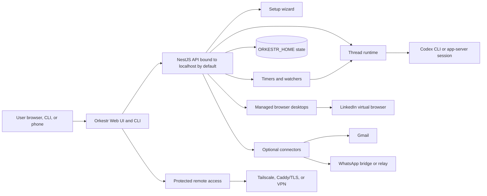

# Architecture Diagram

Orkestr is a local-first control surface around Codex and user-owned
connectors. The public OSS repo contains generic runtime code and public-safe
examples only; private overlays, connector state, browser profiles, and secrets
belong outside the repo.

## Boundary

- Orkestr runs and supervises agents.
- Codex remains the coding agent.
- Connectors are optional capabilities owned by the operator.
- oXRM is a separate workflow app that gives agents relationship state.
- Cross-project integration should use MCP/API contracts, not private package
  coupling.

