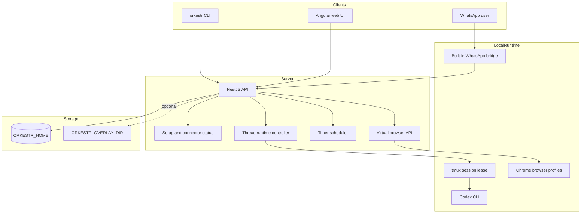

# Architecture

Orkestr is a self-hosted agent workstation monorepo with a small API server, a web cockpit, a CLI, and reusable packages.

## Runtime Boundary

The public API stores thread state, messages, connector status, timers, and browser profile metadata under `ORKESTR_HOME`.

Codex execution is intentionally local. The thread runtime wakes a tmux session and starts Codex in the thread workspace. Private deployments can customize launch behavior through environment variables or overlays, but the public repo must not contain private host assumptions.

## Deployment Boundary

Local and VPS deployments use host-native processes. A VPS should use the
systemd installer so Caddy, Tailscale, browser desktops, logs, and pairing
approval stay on the host where operators expect them.

## Connector Boundary

The public connector surface contains generic setup and routing code. Real credentials and session state stay outside the repo:

- Gmail tokens go under `ORKESTR_HOME/secrets`.
- WhatsApp Web session data stays under `ORKESTR_HOME`.
- Browser profiles stay under `ORKESTR_HOME/browsers`.
- Host-specific bindings live in private overlays.

## Web Routes

- `/setup` opens the setup dashboard for secure access, accounts, runtimes, and connectors.
- `/thread/:id` opens a thread.
- `/ops` opens system tools.
- Legacy `/ng/*` paths are accepted for compatibility while public docs use clean paths.
