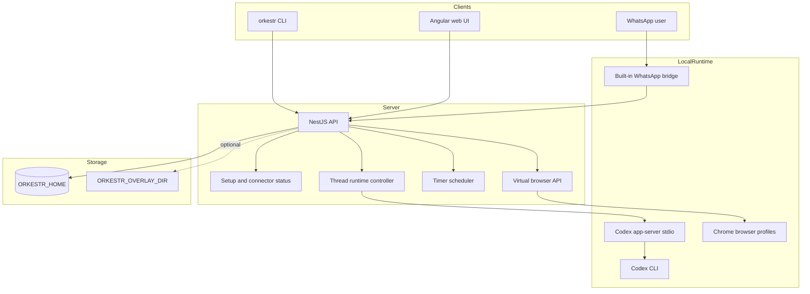

# Architecture

Orkestr is a self-hosted agent workstation monorepo with a small API server, a web cockpit, a CLI, and reusable packages.

The long-term package boundary and migration rules are defined in
[ADR 0001](adr/0001-architecture-boundaries.md). New code should follow that
dependency direction even while legacy runtime and connector files are being
split.

## Runtime Boundary

The public API stores thread state, messages, connector status, timers, and browser profile metadata under `ORKESTR_HOME`.

Codex execution is intentionally local. New coding threads use the Codex CLI
app-server over stdio so Orkestr can start turns, receive structured progress,
mirror approvals, and import existing Codex app-server threads without scraping a
terminal. Older Orkestr Codex threads must be migrated once with
`orkestr codex migrate`; Orkestr does not keep a tmux/Codex fallback path for
Codex execution. Private deployments can customize non-Codex launch behavior
through environment variables or overlays, but the public repo must not contain
private host assumptions.

## Deployment Boundary

Local and VPS deployments use host-native processes. A VPS should use the
systemd installer so Caddy, Tailscale, browser desktops, logs, and pairing
approval stay on the host where operators expect them.

## Distribution Boundary

The OSS distribution is the public self-hosted Codex control center. It must
install and run from a clean checkout without managed/private operator state.
The managed/private distribution can add production accounts, aggregated broker
views, private overlays, and deployment-specific automation, but those additions
must not become required imports or setup prerequisites for the OSS path.

The boundary is documented in [OSS And Managed Boundary](oss-managed-boundary.md)
and guarded by `npm run oss:boundary-check`.

## Tenant Instance Bootstrap

The control plane provisions public-user isolation as a tenant VM baseline. The
KubeVirt cloud-init plan writes a public-safe tenant bootstrap profile before it
runs the normal VPS bootstrap script. That profile describes only non-secret
defaults for the tenant's first Codex chat, workspace root, desktop surfaces,
enabled skills, connector labels, and containment policy. Connector credentials,
browser sessions, WhatsApp state, and user files are created inside the tenant
instance after setup; they are not embedded in the profile or KubeVirt manifest.

## Connector Boundary

The public connector surface contains generic setup and routing code. Real
credentials and session state stay outside the repo:

- Admin connector tokens go under `ORKESTR_HOME/secrets`; non-admin Gmail and
  Outlook tokens go under `ORKESTR_HOME/users/<user-id>/secrets`.
- WhatsApp Web session data stays under the tenant instance home. Generated
  user routing stores only scoped identity metadata for the user.
- Admin browser profiles stay under `ORKESTR_HOME/browsers`; non-admin browser
  profiles stay under `ORKESTR_HOME/users/<user-id>/browsers`.
- Host-specific bindings live in private overlays.

## Secret Boundary

The first-class secret manager is secure-input. APIs, CLI commands, setup UI,
and connectors should exchange secret handles and metadata rather than raw
values. See [Secret Manager](secret-manager.md) for storage, scope, and migration
rules.

## Web Routes

- `/setup` opens the setup dashboard for secure access, accounts, runtimes, and connectors.
- `/thread/:id` opens a thread.
- `/ops` opens system tools.
- Legacy `/ng/*` paths are accepted for compatibility while public docs use clean paths.
